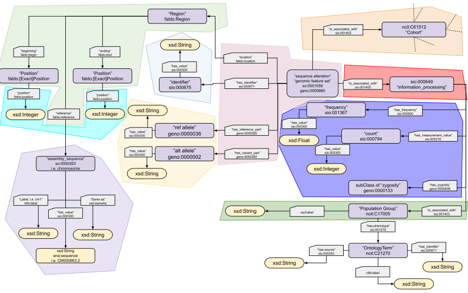

# ETL workflow to transform iCAN clinical+exome data into an RDF ressource

### What is this about?
This repository contains the code for the etl4fairdata_AIC snakemake pipeline. 
The pipeline extracts and transforms data from different sources and prepares it to be loaded in a FAIR genomic ecosystem.
The pipeline needs:
- a csv containing clinical/phenotypical data, extracted from medical databases for example
- a VCF file containing individual genotypes
The pipeline main products are:
- an aggregated vcf file where individual genotypes are aggregated into frequencies and counts, relative to different clinical/phenotypical traits
- a ttl file representing the vcf according to a data model

In practical terms, I used the VCF file containing filtered exome variants as called by R. Blanchet and the csv file extracted from the GAIA:iCAN database containing information about the iCAN Cohort. The ETL pipeline is highly tailored to the phenotypes registered in iCAN.

There is a separate collection of scripts inside buildsyntheticdataset/ folder to, well, build a synthetic dataset so an example demo can be deployed online.

### The data model
As of 21-02-2025


Documentation available at https://ican.univ-nantes.io/variants-kg-schema/

### Enviroment
 micromamba list > conda/environement-etl4fair.yml
 snakemake --dag targets | dot -Tpng > dag.png
 NB: in 'src/' python scripts starting with xxx are not meant to be executed, but are ressources for other scripts because I like fragmenting my code a lot.

### Script logic

1) Check validity of vcf.gz file
2) Extract resired variant lines with bcftools query: chr pos ref alt info -> intermediate file
3) Extract header and all the tags, build df, array of dict of tags: 
'AF_female' : {'name' : 'AF_female', 'definition' : 'definition extracted from header', ontology :  'ncit', 'code': 'C121212'}
4) Function that transforms a line into a triple pattern using the chosen ontologies -> this should be the only function where rdflib is used
5) Function that processes several lines in batches of size n
6) Parallelization function

### TODOs
- For variants that do not have a gnomad frequency or other frequency, should the frequency be set to 0 in the rdf file or simply not included? Now it appears as "NaN"^^xsd:float
- [DONE, september 2024 + february 2025] - Add logger and verbose argument for vcfaggregate3rdf_v2.py 
- [USELESS, added -T option] Add custom check function that prevents the usage of both --limit and (--chunk or --threads)
- [USELESS, added -T option] Add custom adaptation of chunksize according to the number of variants in the vcf file
- [DONE, december 24] - Maybe add function in vcfaggregate3rdf.py that checks if the number of variants is the same in the vcf and in the final rdf -> it is also a sanity check in the snakemake pipeline
- Issue with clean up function -> I want to keep the intermediate merged file, but it is deleted. why?
- Add tests
- [DONE, september 2024] - Multithread computeallelefrequency.py
- [DONE, november 2024] - Lower the complexity of computeallelefrequency.py : loop over genotyped df as little
as possible
- [DONE, february 2025] Build rdf in vcfaggregate2rdf in a prettier way: now it is spaghetti code with rdflib
- [DONE, january 2025] - Add homozygous and heterozygous counts
- [DONE, varil 2025] - create a sturdier test dataset --> syntheticican2 (see inex-med Neurovasc jupyter notebook)

### What happens after the Snakemake pipeline ?
Setting up a fuseki server for sparql queries
>fuseki-server --file=the-awesome-aggregated-variants.ttl /ican

Please visit: https://10-54-1-83.gcp.glicid.fr/

Next step is building sparql query example catalog. See (sq4av) sparqlqueries4aggregatedvariants repo.

### Example of SPARQL queries


```sparql 
PREFIX up: <http://purl.uniprot.org/core/>
PREFIX rdf: <http://www.w3.org/1999/02/22-rdf-syntax-ns#>
PREFIX faldo: <http://biohackathon.org/resource/faldo#>
PREFIX so: <http://purl.obolibrary.org/obo/SO_>
#
PREFIX wdp: <http://www.wikidata.org/prop/>
PREFIX wdpq: <http://www.wikidata.org/prop/qualifier/>
PREFIX wdps: <http://www.wikidata.org/prop/statement/>
PREFIX wdt: <http://www.wikidata.org/prop/direct/>
PREFIX rdfs: <http://www.w3.org/2000/01/rdf-schema#>
#
PREFIX xsd: <http://www.w3.org/2001/XMLSchema#>

SELECT ?variant ?v_start ?v_end ?v_chromosome ?p_chromosome ?proteinID ?chromosome ?startcoordinate ?endcoordinate WHERE {
  ?variant a so:0001059 .
  ?variant faldo:location ?Region .
  # seqid 
  ?Region faldo:reference ?RefSeqId .
  ?RefSeqId rdf:label ?v_chromosome .
  # start
  ?Region faldo:begin ?BeginPosition .
  ?BeginPosition faldo:position ?v_start .
  # end
  ?Region faldo:end ?EndPosition .
  ?EndPosition faldo:position ?v_end .
  
  BIND(?v_chromosome AS ?p_chromosome) .
 
  SERVICE <https://query.wikidata.org/sparql> {
    ?wp wdt:P352 ?proteinID ;
        wdt:P702 ?wg . 
    ?wg wdp:P644 ?wgss ;
        wdp:P645 ?wgse .
    ?wgss wdps:P644 ?startcoordinate ;
        wdpq:P1057/wdt:P1813 ?chromosome ;
        wdpq:P659/rdfs:label ?assembly .
    ?wgse wdps:P645 ?endcoordinate ;
        wdpq:P1057/wdt:P1813 ?chromosome ;
        wdpq:P659/rdfs:label ?assembly .
    FILTER(lang(?assembly) = "en")
    FILTER(STR(?assembly) = "genome assembly GRCh38")
    FILTER(xsd:integer(?chromosome) = 1 )
  }
  
  FILTER( (((?v_start >= xsd:integer(?startcoordinate)) && 
            (?v_start <= xsd:integer(?endcoordinate)) )) 
        || ((?v_end >= xsd:integer(?startcoordinate)) && 
            (?v_end <= xsd:integer(?endcoordinate))) )

} LIMIT 10

```

### About input files 
QCed.VEP.AFctrls.GND.CADD.bcf 
- has positions with genotypes that are all reference like
- has samples that are not in the phenotype file
- has samples that are a merge of two samples in the phenotype file
signaled like sample1_sample2. These need to be eliminated as this is
contamination.
- Quality filtered variants
- VEP annotation
- CADD scores
- exomes
extraction_GAIA_ICAN_26-09-2023.csv


### Authors & Licence
Alexandrina Bodrug while at Institut du Thorax
[MIT LICENCE](LICENCE)