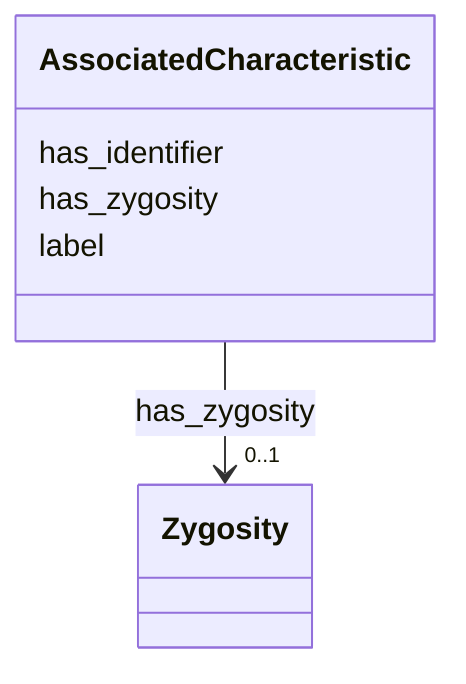

# Class: AssociatedCharacteristic


_Represents a phenotype, clinical trait or grouping associated with a sequence alteration._


URI: [https://ican.univ-nantes.io/variants-kg/:AssociatedCharacteristic](https://ican.univ-nantes.io/variants-kg/:AssociatedCharacteristic)





<!-- no inheritance hierarchy -->


## Slots

| Name | Cardinality and Range | Description | Inheritance |
| ---  | --- | --- | --- |
| [has_identifier](has_identifier.md) | 0..1 <br/> [String](String.md) | A unique identifier for the associated characteristic | direct |
| [label](label.md) | 0..1 <br/> [String](String.md) | A human-readable label for the associated characteristic | direct |
| [has_zygosity](has_zygosity.md) | 0..1 <br/> [Zygosity](Zygosity.md) | The zygocity of the associated characteristic | direct |


## Usages

| used by | used in | type | used |
| ---  | --- | --- | --- |
| [SequenceAlteration](SequenceAlteration.md) | [is_associated_with](is_associated_with.md) | range | [AssociatedCharacteristic](AssociatedCharacteristic.md) |


## Identifier and Mapping Information


### Schema Source


* from schema: https://ican.univ-nantes.io/variants-kg


## Mappings

| Mapping Type | Mapped Value |
| ---  | ---  |
| self | https://ican.univ-nantes.io/variants-kg/:AssociatedCharacteristic |
| native | https://ican.univ-nantes.io/variants-kg/:AssociatedCharacteristic |


## LinkML Source

<!-- TODO: investigate https://stackoverflow.com/questions/37606292/how-to-create-tabbed-code-blocks-in-mkdocs-or-sphinx -->

### Direct

<details>
```yaml
name: AssociatedCharacteristic
description: Represents a phenotype, clinical trait or grouping associated with a
  sequence alteration.
from_schema: https://ican.univ-nantes.io/variants-kg
attributes:
  has_identifier:
    name: has_identifier
    description: A unique identifier for the associated characteristic.
    from_schema: https://ican.univ-nantes.io/variants-kg
    slot_uri: sio:000300
    domain_of:
    - SequenceAlteration
    - AssociatedCharacteristic
    range: string
    required: false
  label:
    name: label
    description: A human-readable label for the associated characteristic.
    from_schema: https://ican.univ-nantes.io/variants-kg
    slot_uri: rdfs:label
    domain_of:
    - VariationSiteReference
    - AssociatedCharacteristic
    range: string
    required: false
  has_zygosity:
    name: has_zygosity
    description: The zygocity of the associated characteristic.
    from_schema: https://ican.univ-nantes.io/variants-kg
    rank: 1000
    slot_uri: geno:0000608
    domain_of:
    - AssociatedCharacteristic
    range: Zygosity
    required: false

```
</details>

### Induced

<details>
```yaml
name: AssociatedCharacteristic
description: Represents a phenotype, clinical trait or grouping associated with a
  sequence alteration.
from_schema: https://ican.univ-nantes.io/variants-kg
attributes:
  has_identifier:
    name: has_identifier
    description: A unique identifier for the associated characteristic.
    from_schema: https://ican.univ-nantes.io/variants-kg
    slot_uri: sio:000300
    alias: has_identifier
    owner: AssociatedCharacteristic
    domain_of:
    - SequenceAlteration
    - AssociatedCharacteristic
    range: string
    required: false
  label:
    name: label
    description: A human-readable label for the associated characteristic.
    from_schema: https://ican.univ-nantes.io/variants-kg
    slot_uri: rdfs:label
    alias: label
    owner: AssociatedCharacteristic
    domain_of:
    - VariationSiteReference
    - AssociatedCharacteristic
    range: string
    required: false
  has_zygosity:
    name: has_zygosity
    description: The zygocity of the associated characteristic.
    from_schema: https://ican.univ-nantes.io/variants-kg
    rank: 1000
    slot_uri: geno:0000608
    alias: has_zygosity
    owner: AssociatedCharacteristic
    domain_of:
    - AssociatedCharacteristic
    range: Zygosity
    required: false

```
</details>