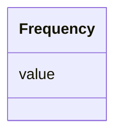

# Class: Frequency


_Represents the frequency of an allele in individuals with a certain zygosity._


URI: [https://ican.univ-nantes.io/variants-kg/:Frequency](https://ican.univ-nantes.io/variants-kg/:Frequency)





<!-- no inheritance hierarchy -->


## Slots

| Name | Cardinality and Range | Description | Inheritance |
| ---  | --- | --- | --- |
| [value](value.md) | 1 <br/> [Float](Float.md) | The frequency value | direct |


## Usages

| used by | used in | type | used |
| ---  | --- | --- | --- |
| [Zygosity](Zygosity.md) | [has_frequency](has_frequency.md) | range | [Frequency](Frequency.md) |


## Identifier and Mapping Information


### Schema Source


* from schema: https://ican.univ-nantes.io/variants-kg


## Mappings

| Mapping Type | Mapped Value |
| ---  | ---  |
| self | https://ican.univ-nantes.io/variants-kg/:Frequency |
| native | https://ican.univ-nantes.io/variants-kg/:Frequency |


## LinkML Source

<!-- TODO: investigate https://stackoverflow.com/questions/37606292/how-to-create-tabbed-code-blocks-in-mkdocs-or-sphinx -->

### Direct

<details>
```yaml
name: Frequency
description: Represents the frequency of an allele in individuals with a certain zygosity.
from_schema: https://ican.univ-nantes.io/variants-kg
attributes:
  value:
    name: value
    description: The frequency value.
    from_schema: https://ican.univ-nantes.io/variants-kg
    slot_uri: sio:000300
    domain_of:
    - ReferenceAllele
    - AlternateAllele
    - VariationSiteReference
    - Frequency
    - Count
    range: float
    required: true

```
</details>

### Induced

<details>
```yaml
name: Frequency
description: Represents the frequency of an allele in individuals with a certain zygosity.
from_schema: https://ican.univ-nantes.io/variants-kg
attributes:
  value:
    name: value
    description: The frequency value.
    from_schema: https://ican.univ-nantes.io/variants-kg
    slot_uri: sio:000300
    alias: value
    owner: Frequency
    domain_of:
    - ReferenceAllele
    - AlternateAllele
    - VariationSiteReference
    - Frequency
    - Count
    range: float
    required: true

```
</details>