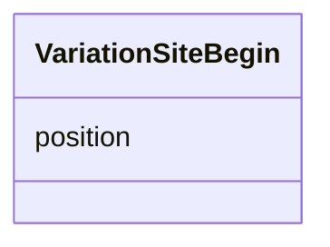

# Class: VariationSiteBegin


_Represents the beginning of the location of a sequence alteration._


URI: [faldo:ExactPosition](http://biohackathon.org/resource/faldo#ExactPosition)





<!-- no inheritance hierarchy -->


## Slots

| Name | Cardinality and Range | Description | Inheritance |
| ---  | --- | --- | --- |
| [position](position.md) | 1 <br/> [Integer](Integer.md) | The position of the beginning of the location of the sequence alteration | direct |


## Usages

| used by | used in | type | used |
| ---  | --- | --- | --- |
| [VariationSite](VariationSite.md) | [begins_at](begins_at.md) | range | [VariationSiteBegin](VariationSiteBegin.md) |


## Identifier and Mapping Information


### Schema Source


* from schema: https://ican.univ-nantes.io/variants-kg


## Mappings

| Mapping Type | Mapped Value |
| ---  | ---  |
| self | faldo:ExactPosition |
| native | https://ican.univ-nantes.io/variants-kg/:VariationSiteBegin |


## LinkML Source

<!-- TODO: investigate https://stackoverflow.com/questions/37606292/how-to-create-tabbed-code-blocks-in-mkdocs-or-sphinx -->

### Direct

<details>
```yaml
name: VariationSiteBegin
description: Represents the beginning of the location of a sequence alteration.
from_schema: https://ican.univ-nantes.io/variants-kg
attributes:
  position:
    name: position
    description: The position of the beginning of the location of the sequence alteration.
    from_schema: https://ican.univ-nantes.io/variants-kg
    rank: 1000
    slot_uri: faldo:position
    domain_of:
    - VariationSiteBegin
    - VariationSiteEnd
    range: integer
    required: true
class_uri: faldo:ExactPosition

```
</details>

### Induced

<details>
```yaml
name: VariationSiteBegin
description: Represents the beginning of the location of a sequence alteration.
from_schema: https://ican.univ-nantes.io/variants-kg
attributes:
  position:
    name: position
    description: The position of the beginning of the location of the sequence alteration.
    from_schema: https://ican.univ-nantes.io/variants-kg
    rank: 1000
    slot_uri: faldo:position
    alias: position
    owner: VariationSiteBegin
    domain_of:
    - VariationSiteBegin
    - VariationSiteEnd
    range: integer
    required: true
class_uri: faldo:ExactPosition

```
</details>