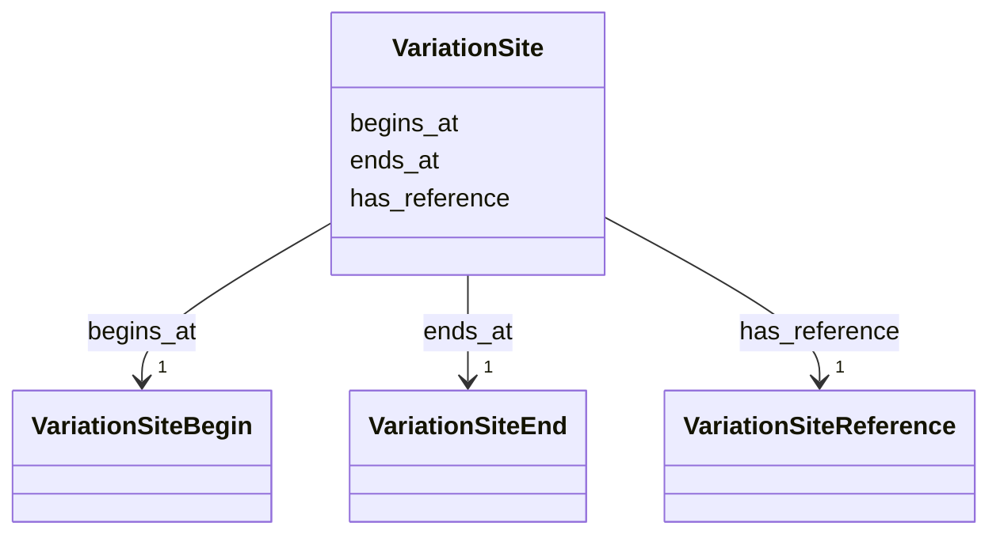

# Class: VariationSite


_Represents the location of a sequence alteration._


URI: [faldo:Region](http://biohackathon.org/resource/faldo#Region)





<!-- no inheritance hierarchy -->


## Slots

| Name | Cardinality and Range | Description | Inheritance |
| ---  | --- | --- | --- |
| [begins_at](begins_at.md) | 1 <br/> [VariationSiteBegin](VariationSiteBegin.md) | The beginning of the location of the sequence alteration | direct |
| [ends_at](ends_at.md) | 1 <br/> [VariationSiteEnd](VariationSiteEnd.md) | The end of the location of the sequence alteration | direct |
| [has_reference](has_reference.md) | 1 <br/> [VariationSiteReference](VariationSiteReference.md) | The reference sequence (contig, sequence, chromosome) | direct |


## Usages

| used by | used in | type | used |
| ---  | --- | --- | --- |
| [SequenceAlteration](SequenceAlteration.md) | [has_location](has_location.md) | range | [VariationSite](VariationSite.md) |


## Identifier and Mapping Information


### Schema Source


* from schema: https://ican.univ-nantes.io/variants-kg


## Mappings

| Mapping Type | Mapped Value |
| ---  | ---  |
| self | faldo:Region |
| native | https://ican.univ-nantes.io/variants-kg/:VariationSite |


## LinkML Source

<!-- TODO: investigate https://stackoverflow.com/questions/37606292/how-to-create-tabbed-code-blocks-in-mkdocs-or-sphinx -->

### Direct

<details>
```yaml
name: VariationSite
description: Represents the location of a sequence alteration.
from_schema: https://ican.univ-nantes.io/variants-kg
attributes:
  begins_at:
    name: begins_at
    description: The beginning of the location of the sequence alteration.
    from_schema: https://ican.univ-nantes.io/variants-kg
    rank: 1000
    slot_uri: faldo:begin
    domain_of:
    - VariationSite
    range: VariationSiteBegin
    required: true
  ends_at:
    name: ends_at
    description: The end of the location of the sequence alteration.
    from_schema: https://ican.univ-nantes.io/variants-kg
    rank: 1000
    slot_uri: faldo:end
    domain_of:
    - VariationSite
    range: VariationSiteEnd
    required: true
  has_reference:
    name: has_reference
    description: The reference sequence (contig, sequence, chromosome).
    from_schema: https://ican.univ-nantes.io/variants-kg
    rank: 1000
    slot_uri: faldo:reference
    domain_of:
    - VariationSite
    range: VariationSiteReference
    required: true
class_uri: faldo:Region

```
</details>

### Induced

<details>
```yaml
name: VariationSite
description: Represents the location of a sequence alteration.
from_schema: https://ican.univ-nantes.io/variants-kg
attributes:
  begins_at:
    name: begins_at
    description: The beginning of the location of the sequence alteration.
    from_schema: https://ican.univ-nantes.io/variants-kg
    rank: 1000
    slot_uri: faldo:begin
    alias: begins_at
    owner: VariationSite
    domain_of:
    - VariationSite
    range: VariationSiteBegin
    required: true
  ends_at:
    name: ends_at
    description: The end of the location of the sequence alteration.
    from_schema: https://ican.univ-nantes.io/variants-kg
    rank: 1000
    slot_uri: faldo:end
    alias: ends_at
    owner: VariationSite
    domain_of:
    - VariationSite
    range: VariationSiteEnd
    required: true
  has_reference:
    name: has_reference
    description: The reference sequence (contig, sequence, chromosome).
    from_schema: https://ican.univ-nantes.io/variants-kg
    rank: 1000
    slot_uri: faldo:reference
    alias: has_reference
    owner: VariationSite
    domain_of:
    - VariationSite
    range: VariationSiteReference
    required: true
class_uri: faldo:Region

```
</details>