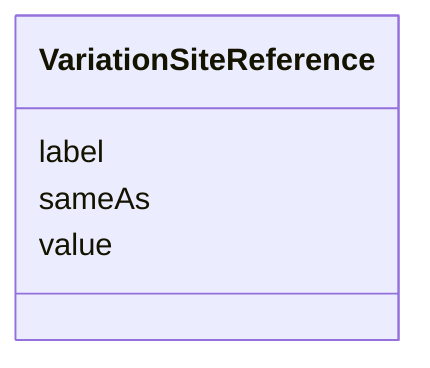

# Class: VariationSiteReference


_Represents the reference sequence (contig, sequence, chromosome)._


URI: [so:0000353](http://purl.obolibrary.org/obo/SO_0000353)





<!-- no inheritance hierarchy -->


## Slots

| Name | Cardinality and Range | Description | Inheritance |
| ---  | --- | --- | --- |
| [value](value.md) | 1 <br/> [String](String.md) | The value of the reference sequence (ena sequence i | direct |
| [label](label.md) | 1 <br/> [String](String.md) | A human-readable label for the reference sequence | direct |
| [sameAs](sameAs.md) | 1 <br/> [String](String.md) | The value of the reference sequence in another database (ncbi sequence i | direct |


## Usages

| used by | used in | type | used |
| ---  | --- | --- | --- |
| [VariationSite](VariationSite.md) | [has_reference](has_reference.md) | range | [VariationSiteReference](VariationSiteReference.md) |


## Identifier and Mapping Information


### Schema Source


* from schema: https://ican.univ-nantes.io/variants-kg


## Mappings

| Mapping Type | Mapped Value |
| ---  | ---  |
| self | so:0000353 |
| native | https://ican.univ-nantes.io/variants-kg/:VariationSiteReference |


## LinkML Source

<!-- TODO: investigate https://stackoverflow.com/questions/37606292/how-to-create-tabbed-code-blocks-in-mkdocs-or-sphinx -->

### Direct

<details>
```yaml
name: VariationSiteReference
description: Represents the reference sequence (contig, sequence, chromosome).
from_schema: https://ican.univ-nantes.io/variants-kg
attributes:
  value:
    name: value
    description: The value of the reference sequence (ena sequence i.e. https://www.ebi.ac.uk/ena/browser/view/CM000684.2).
    from_schema: https://ican.univ-nantes.io/variants-kg
    domain_of:
    - ReferenceAllele
    - AlternateAllele
    - VariationSiteReference
    - Frequency
    - Count
    range: string
    required: true
  label:
    name: label
    description: A human-readable label for the reference sequence.
    from_schema: https://ican.univ-nantes.io/variants-kg
    rank: 1000
    slot_uri: rdfs:label
    domain_of:
    - VariationSiteReference
    - AssociatedCharacteristic
    range: string
    required: true
  sameAs:
    name: sameAs
    description: The value of the reference sequence in another database (ncbi sequence
      i.e. https://www.ncbi.nlm.nih.gov/nuccore/NC_000022.11).
    from_schema: https://ican.univ-nantes.io/variants-kg
    rank: 1000
    slot_uri: owl:sameAs
    domain_of:
    - VariationSiteReference
    range: string
    required: true
class_uri: so:0000353

```
</details>

### Induced

<details>
```yaml
name: VariationSiteReference
description: Represents the reference sequence (contig, sequence, chromosome).
from_schema: https://ican.univ-nantes.io/variants-kg
attributes:
  value:
    name: value
    description: The value of the reference sequence (ena sequence i.e. https://www.ebi.ac.uk/ena/browser/view/CM000684.2).
    from_schema: https://ican.univ-nantes.io/variants-kg
    alias: value
    owner: VariationSiteReference
    domain_of:
    - ReferenceAllele
    - AlternateAllele
    - VariationSiteReference
    - Frequency
    - Count
    range: string
    required: true
  label:
    name: label
    description: A human-readable label for the reference sequence.
    from_schema: https://ican.univ-nantes.io/variants-kg
    rank: 1000
    slot_uri: rdfs:label
    alias: label
    owner: VariationSiteReference
    domain_of:
    - VariationSiteReference
    - AssociatedCharacteristic
    range: string
    required: true
  sameAs:
    name: sameAs
    description: The value of the reference sequence in another database (ncbi sequence
      i.e. https://www.ncbi.nlm.nih.gov/nuccore/NC_000022.11).
    from_schema: https://ican.univ-nantes.io/variants-kg
    rank: 1000
    slot_uri: owl:sameAs
    alias: sameAs
    owner: VariationSiteReference
    domain_of:
    - VariationSiteReference
    range: string
    required: true
class_uri: so:0000353

```
</details>