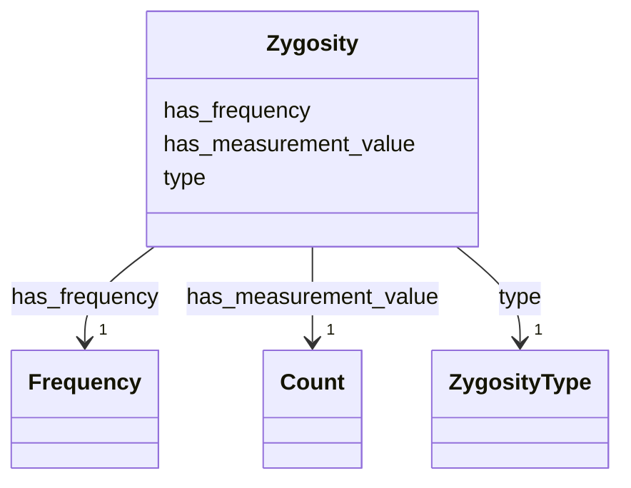

# Class: Zygosity


_Represents the zygosity of an associated characteristic._


URI: [geno:0000133](http://purl.obolibrary.org/obo/GENO_0000133)





<!-- no inheritance hierarchy -->


## Slots

| Name | Cardinality and Range | Description | Inheritance |
| ---  | --- | --- | --- |
| [type](type.md) | 1 <br/> [ZygosityType](ZygosityType.md) | The type of zygosity | direct |
| [has_measurement_value](has_measurement_value.md) | 1 <br/> [Count](Count.md) | Count of alternative alleles in individuals with a certain zygosity | direct |
| [has_frequency](has_frequency.md) | 1 <br/> [Frequency](Frequency.md) | Frequency of the allele in indibiduals with a certain zygosity | direct |


## Usages

| used by | used in | type | used |
| ---  | --- | --- | --- |
| [AssociatedCharacteristic](AssociatedCharacteristic.md) | [has_zygosity](has_zygosity.md) | range | [Zygosity](Zygosity.md) |


## Identifier and Mapping Information


### Schema Source


* from schema: https://ican.univ-nantes.io/variants-kg


## Mappings

| Mapping Type | Mapped Value |
| ---  | ---  |
| self | geno:0000133 |
| native | https://ican.univ-nantes.io/variants-kg/:Zygosity |


## LinkML Source

<!-- TODO: investigate https://stackoverflow.com/questions/37606292/how-to-create-tabbed-code-blocks-in-mkdocs-or-sphinx -->

### Direct

<details>
```yaml
name: Zygosity
description: Represents the zygosity of an associated characteristic.
from_schema: https://ican.univ-nantes.io/variants-kg
attributes:
  type:
    name: type
    description: The type of zygosity.
    from_schema: https://ican.univ-nantes.io/variants-kg
    rank: 1000
    slot_uri: rdfs:type
    domain_of:
    - Zygosity
    range: ZygosityType
    required: true
  has_measurement_value:
    name: has_measurement_value
    description: Count of alternative alleles in individuals with a certain zygosity.
    from_schema: https://ican.univ-nantes.io/variants-kg
    rank: 1000
    slot_uri: sio:000216
    domain_of:
    - Zygosity
    range: Count
    required: true
  has_frequency:
    name: has_frequency
    description: Frequency of the allele in indibiduals with a certain zygosity.
    from_schema: https://ican.univ-nantes.io/variants-kg
    rank: 1000
    slot_uri: sio:000900
    domain_of:
    - Zygosity
    range: Frequency
    required: true
class_uri: geno:0000133

```
</details>

### Induced

<details>
```yaml
name: Zygosity
description: Represents the zygosity of an associated characteristic.
from_schema: https://ican.univ-nantes.io/variants-kg
attributes:
  type:
    name: type
    description: The type of zygosity.
    from_schema: https://ican.univ-nantes.io/variants-kg
    rank: 1000
    slot_uri: rdfs:type
    alias: type
    owner: Zygosity
    domain_of:
    - Zygosity
    range: ZygosityType
    required: true
  has_measurement_value:
    name: has_measurement_value
    description: Count of alternative alleles in individuals with a certain zygosity.
    from_schema: https://ican.univ-nantes.io/variants-kg
    rank: 1000
    slot_uri: sio:000216
    alias: has_measurement_value
    owner: Zygosity
    domain_of:
    - Zygosity
    range: Count
    required: true
  has_frequency:
    name: has_frequency
    description: Frequency of the allele in indibiduals with a certain zygosity.
    from_schema: https://ican.univ-nantes.io/variants-kg
    rank: 1000
    slot_uri: sio:000900
    alias: has_frequency
    owner: Zygosity
    domain_of:
    - Zygosity
    range: Frequency
    required: true
class_uri: geno:0000133

```
</details>